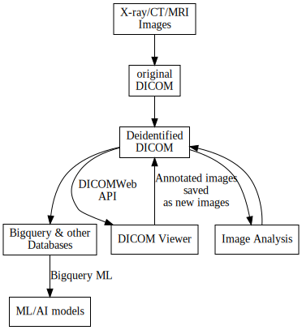

## Technologies used

- [Cloud Run serverless web platform](https://cloud.google.com/run)
- [GCP DICOM, part of the HealthCare API](https://cloud.google.com/healthcare-api/docs/concepts/dicom)
- [DICOM Deidentification API](https://cloud.google.com/healthcare-api/docs/how-tos/dicom-deidentify)
- [Google Cloud Bigquery](https://cloud.google.com/bigquery)
- [Google Cloud Storage](https://cloud.google.com/storage)
- [Google Cloud PubSub](https://cloud.google.com/pubsub)
- [OHIF Dicom Image Viewer](https://ohif.org/)

## Usage

1. Add an image to the dicom store

``` sh
curl -X POST \
    -H "Content-Type: application/dicom" \
    -H "Authorization: Bearer $(gcloud auth application-default print-access-token)" \
    https://healthcare.googleapis.com/v1/projects/uccc-aisr/locations/us-central1/datasets/uccc-aisr-b67a21b/dicomStores/uccc-aisr-ba50ed5/dicomWeb/studies \
    --data-binary @0009.DCM
```

2. Pipeline runs
- deidenfify
- Register DICOM metadata in Bigquery

3. Access images via OHIF browser


## Architecture

```
./generate_arch_diagram.sh
```


## Data Flow


