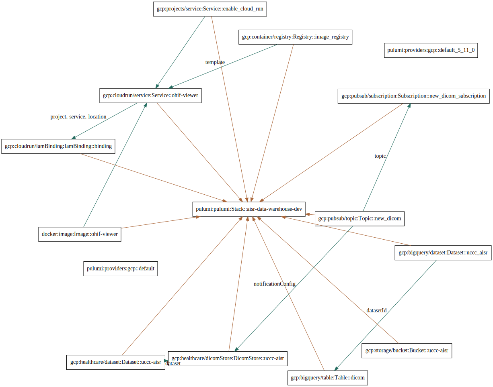

### Add a dicom file to GCP dicom store

``` sh
curl -X POST \
    -H "Content-Type: application/dicom" \
    -H "Authorization: Bearer $(gcloud auth application-default print-access-token)" \
    https://healthcare.googleapis.com/v1/projects/uccc-aisr/locations/us-central1/datasets/uccc-aisr-b67a21b/dicomStores/uccc-aisr-ba50ed5/dicomWeb/studies \
    --data-binary @0009.DCM
```


## Architecture

```
./generate_arch_diagram.sh
```

